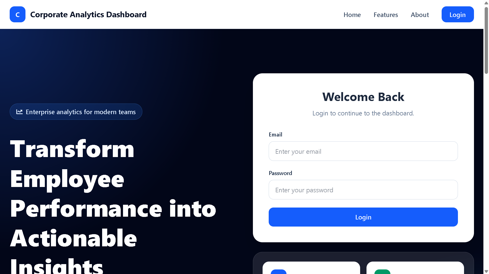
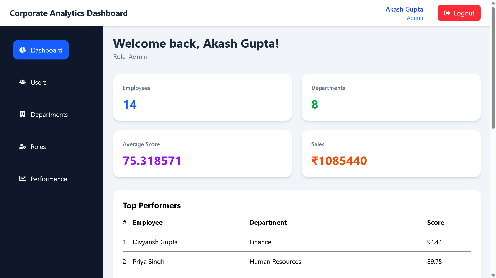
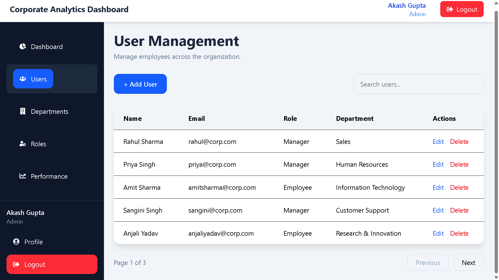
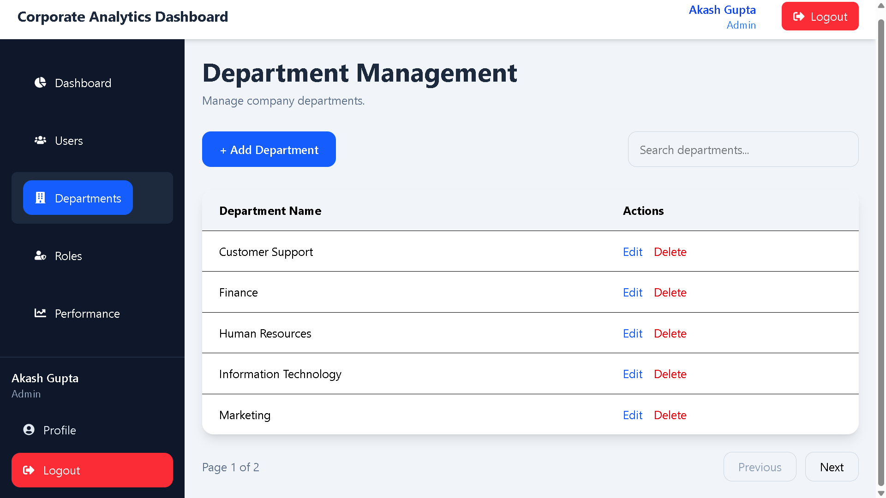
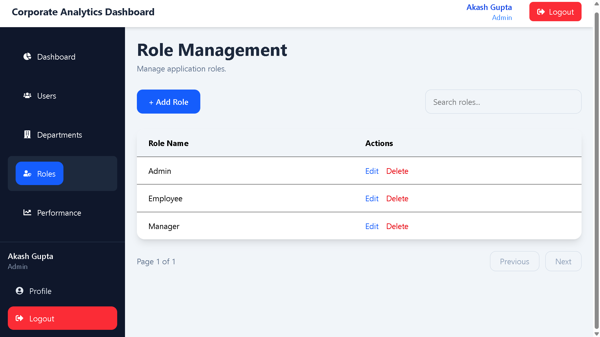
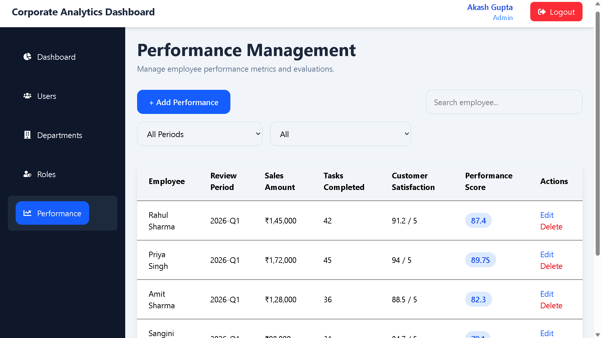
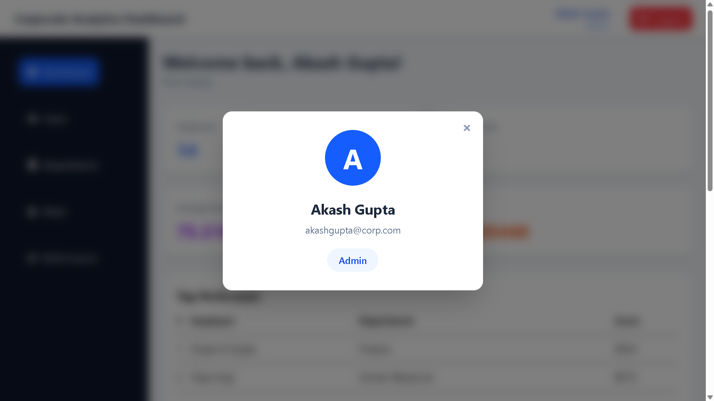

# 📊 Corporate Analytics Dashboard 

[](#)
[](#)
[](#)
[](#)

A robust, full-stack enterprise analytics platform designed to streamline employee performance tracking and organizational management. Built with **Spring Boot** and **React**, this application delivers secure role-based access control (RBAC), interactive data visualization, and complete CRUD capabilities for corporate administration.

---

## 🚀 Live Demo

- **Frontend Application (Vercel):** [View Live](https://corporate-analytics-dashboard.vercel.app)
- **Backend API (Railway):** [View Live](https://steadfast-blessing-production-6011.up.railway.app)
- **GitHub Repository:** [akash-4x3/CorporateAnalyticsDashboard](https://github.com/akash-4x3/CorporateAnalyticsDashboard)

---

## ✨ Key Features

### 🔐 Security & Authentication
- **JWT-Based Authentication:** Stateless, secure sessions.
- **Password Cryptography:** BCrypt hashing for secure credential storage.
- **Role-Based Access Control (RBAC):** Distinct permission tiers for Admins, Managers, and Employees.

### 📈 Analytics Dashboard
- **Real-Time Metrics:** Visual summaries of organizational performance and sales.
- **Departmental Insights:** Track metrics and aggregate performance by department.
- **Employee Rankings:** Automatically highlights top and low performers.
- **Trend Visualization:** Interactive data charts powered by Chart.js.

### 🏢 Corporate Management
- **User Management:** Full CRUD operations with search and pagination capabilities.
- **Department & Role Configuration:** Dynamically add, update, or remove organizational structures.
- **Performance Tracking:** Log, modify, and review historical performance records for all employees.

---

## 🛠 Tech Stack

| Category | Technologies |
| :--- | :--- |
| **Frontend** | React, Vite, Tailwind CSS, Axios, Chart.js |
| **Backend** | Java 17, Spring Boot, Spring Security, Spring Data JPA, JWT, Maven |
| **Database** | MySQL |
| **Deployment** | Vercel (Client), Railway (API & Database) |

---

## 📸 Application Gallery

| Feature | Preview |
|----------|---------|
| **Landing Page** |  |
| **Dashboard** |  |
| **User Management** |  |
| **Department Management**|  |
| **Role Management** |  |
| **Performance Tracking** |  |
| **User Profile** |  |

---

## ⚙️ Local Setup & Installation

### Prerequisites
- Node.js (v18+)
- Java 17+
- MySQL Server

### 1. Clone the Repository
```bash
git clone [https://github.com/akash-4x3/CorporateAnalyticsDashboard.git](https://github.com/akash-4x3/CorporateAnalyticsDashboard.git)
cd CorporateAnalyticsDashboard

```

### 2. Backend Configuration

Navigate to the backend directory and configure your database settings.

```bash
cd backend

```

Update the `src/main/resources/application.properties` file with your local MySQL credentials and JWT secret:

```properties
spring.datasource.url=jdbc:mysql://localhost:3306/your_database_name
spring.datasource.username=your_db_username
spring.datasource.password=your_db_password
jwt.secret=your_generated_secret_key

```

Run the Spring Boot application:

```bash
mvn spring-boot:run

```

### 3. Frontend Configuration

Navigate to the frontend directory and set up your environment variables.

```bash
cd ../frontend
npm install

```

Create a `.env` file in the frontend root and add your backend API URL:

```env
VITE_API_BASE_URL=http://localhost:8080/api

```

Start the development server:

```bash
npm run dev

```

---

## 🔄 Authentication Flow

1. **Client Request:** User submits credentials via the React login form.
2. **Backend Validation:** Spring Security verifies credentials against the MySQL database.
3. **Token Generation:** Upon success, a signed JWT is generated and returned to the client.
4. **State Management:** The token is stored securely in Local Storage.
5. **Authorized Requests:** Axios interceptors automatically attach the `Authorization: Bearer <token>` header to all outgoing protected requests.
6. **Resource Access:** Spring Security validates the token signature and grants/denies access based on the user's role.

---

## 🚀 Future Roadmap

* [ ] **Export Capabilities:** Download reports in PDF and Excel formats.
* [ ] **Automated Alerts:** Email notifications for performance reviews and updates.
* [ ] **Audit Logging:** Track administrative actions for security compliance.
* [ ] **UI Enhancements:** Implement a system-wide Dark Mode.
* [ ] **Containerization:** Add Docker support for streamlined deployment.

---

## 👨‍💻 Author

**Akash Kumar**

* GitHub: [@akash-4x3](https://github.com/akash-4x3)

---

⭐️ **If you found this project helpful or learned something new, please consider giving it a star!**

```

<FollowUp label="Want to add an API documentation section?" query="Help me write a concise API Endpoints section for my README detailing the main routes."/>